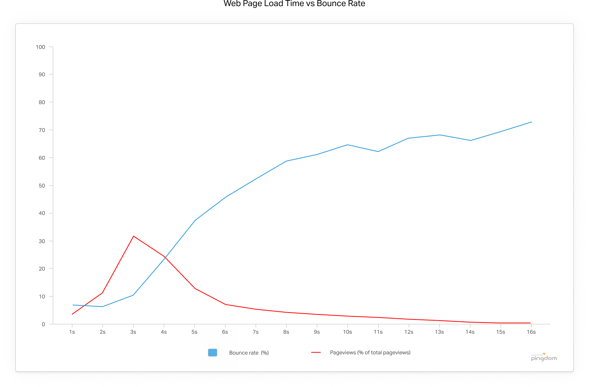

# [fit] データベースを20倍速くする チューニングデモ
## ＝SQLを高速化する為の基本を知る＝

 

## 2019/09/15 OSC 2019 Hiroshima
## 日本PostgreSQLユーザー会　

---

# [fit]突然ですがこのグラフ何？

読み込み時間と共にWebページから
離脱する人のグラフ

**大体 3秒経てば 3割以上が離脱する**

出典： https://royal.pingdom.com/page-load-time-really-affect-bounce-rate/

---

## デモ

- Docker で PostgreSQLのインスタンスを立ててみる
- customers テーブルから 
名前で１件検索する時のSQLの抽出方法を見てみる。
- 名前にインデックスを貼ってみる。
- もう一度、Explain文を見てみる。